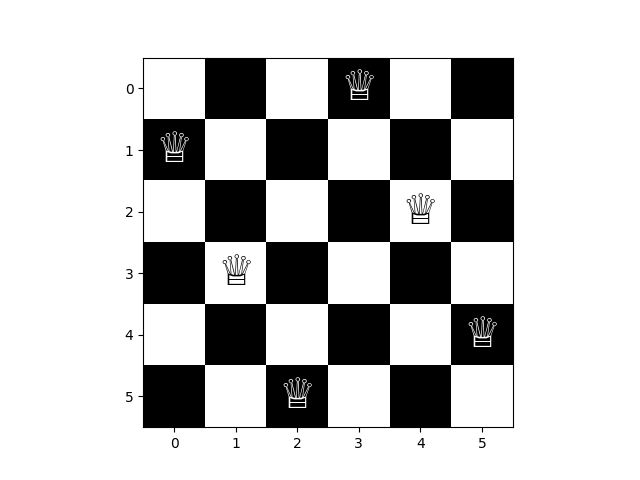

[](
  https://circleci.com/gh/dwave-examples/n-queens)

# N Queens

The [n-queens problem](https://en.wikipedia.org/wiki/Eight_queens_puzzle) refers
to the problem of placing n queens on an n*n chessboard, such that no two queens
are able to attack each other.

Here is an example solution for a 6-queens problem:



Though the n-queens problem is more often studied theoretically, it has been
shown to have its applications. For instance, in a system requiring deadlock
prevention, solving the n-queens problem would be equivalent to finding a set of
deadlock free paths [4]. Other practical applications utilizing the n-queens
problem include parallel memory storage schemes, VLSI testing, and traffic
control [4].

This example demonstrates how to formulate the n-queens problem as a quadratic
unconstrained binary optimization (QUBO) problem, which we then solve with
Leap's hybrid solvers.

## Usage

To run this example:

```bash
python n_queens.py
```

The program prompts the user to enter the number of queens (n) to place. It
should be noted that larger n will take longer to run and we do not recommend
running this example on n > 200.

The solution image file ('n-queens-solution.png') will be saved in the root
directory.

## Code Overview

We formulate the n-queens problem as a [generalized exact cover
problem](https://en.wikipedia.org/wiki/Exact_cover) with four types of
constraints:

1) Exactly one queen in each column.
2) Exactly one queen in each row.
3) At most one queen in each diagonal from top-left to bottom-right.
4) At most one queen in each diagonal from bottom-left to top-right.

Here is a brief overview of the code:

* Represent each constraint with a unique number (ID).
* Represent each position on the chessboard with a subset of constraint IDs.
* Form a binary quadratic model (BQM) using these subsets of constraints.
* Run the problem (solve the BQM).
* Validate the solution.
* Plot the solution on a chessboard and save the solution image file.

## Code Specifics

Some notes to consider:

* Since there is exactly one queen on each row and column, we utilize a
  generalized version of the exact cover algorithm (specified in [1]) to handle
  the row and column constraints. This code can be found in exact_cover.py. The
  diagonal constraints are handled separately in n_queens.py.

* Each position on the chessboard (each subset of constraint IDs) becomes a
  variable in the BQM. That means that there are n**2 variables.

## References

[1] Andrew Lucas, "Ising formulations of many NP problems",
[doi:10.3389/fphy.2014.00005](https://www.frontiersin.org/articles/10.3389/fphy.2014.00005/full)

[2] Thijs Metsch, "Dancing links, algorithm X and the n-queens puzzle",
http://www.nohuddleoffense.de/2019/01/20/dancing-links-algorithm-x-and-the-n-queens-puzzle/

[3] Wikipedia contributors, "Eight queens puzzle" Wikipedia, The Free
Encyclopedia, https://en.wikipedia.org/wiki/Eight_queens_puzzle

[4] Jordan Bell & Brett Stevens, "A survey of known results and research areas
for n-queens",
[doi.org/10.1016/j.disc.2007.12.043](https://www.sciencedirect.com/science/article/pii/S0012365X07010394)

## License

Released under the Apache License 2.0. See [LICENSE](LICENSE) file.
